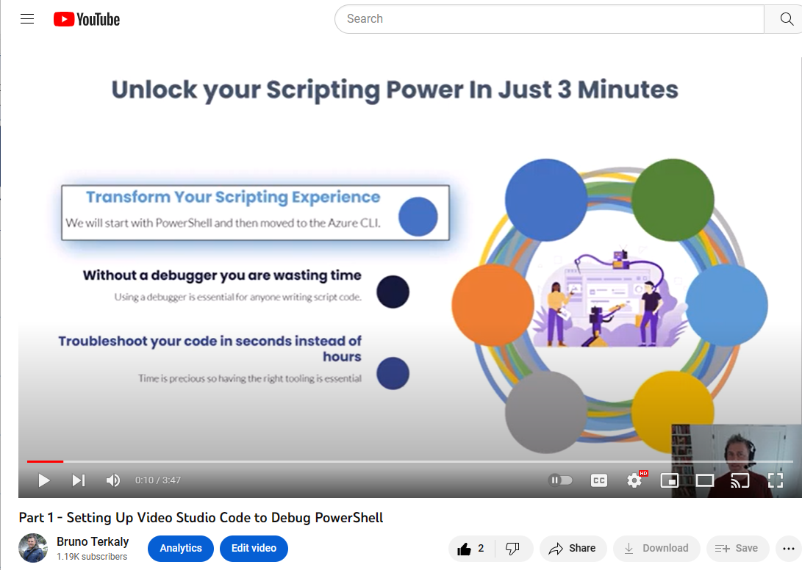

# Azure CLI Read Me for YouTube Videos

The purpose of this readme is to provide supporting documentation for the YouTube videos.

## Setting up VS Code

1. To see the Visual Studio Code installation, you can watch the first video [here](https://www.youtube.com/watch?v=2-Z8cE1Pz5c).



- The link to the download for Visual Studio Code can be found [here](PowerShellReadme.md) for the PowerShell module. Visual Studio Code is used both for PowerShell and BASH (Azure CLI).

## The Hello Azure CLI code:

```
echo "Hello "
echo "Azure CLI"
```

## Some resources to learning the Visual Studio Code Debugger.

    [YouTube Debugging Videos](https://www.youtube.com/results?search_query=using+the+visual+studio+debugger)

