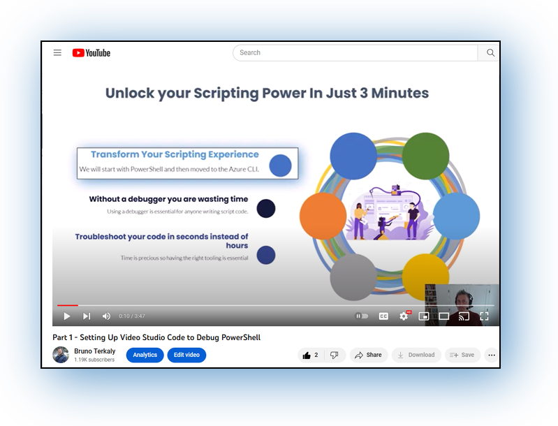

# Azure CLI Read Me for YouTube Videos

The purpose of this readme is to provide supporting documentation for the YouTube videos.

## Table of Contents

- [Azure CLI Read Me for YouTube Videos](#azure-cli-read-me-for-youtube-videos)
  - [Table of Contents](#table-of-contents)
  - [Setting up VS Code](#setting-up-vs-code)
  - [Installing the Azure CLI](#installing-the-azure-cli)
  - [The Hello Azure CLI code:](#the-hello-azure-cli-code)
  - [More involved BASH code](#more-involved-bash-code)
  - [Fancy Azure CLI](#fancy-azure-cli)
  - [Install WSH](#install-wsh)
  - [Some resources to learning the Visual Studio Code Debugger.](#some-resources-to-learning-the-visual-studio-code-debugger)


## Setting up VS Code

1. To see the Visual Studio Code installation, you can watch the first video [here](https://www.youtube.com/watch?v=2-Z8cE1Pz5c).



- The link to the download for Visual Studio Code can be found [here](PowerShellReadme.md) for the PowerShell module. Visual Studio Code is used both for PowerShell and BASH (Azure CLI).


## Installing the Azure CLI

```
curl -sL https://aka.ms/InstallAzureCLIDeb | sudo bash
```

## The Hello Azure CLI code:

```
#!/bin/bash
echo "Hello "
echo "Azure CLI"
```

## More involved BASH code

```
#!/bin/bash

# Define the array of names
names=("Alice" "Bob" "Charlie" "Dave" "Eve")

# Loop through the array
for name in "${names[@]}"
do
    # Say hello to the current name
    echo "Hello $name"
done
```
## Fancy Azure CLI

```
#!/bin/bash

# Run the az vm list command and store the output in a variable
vms=$(az vm list --output table)

# Loop through each line of the output
while IFS= read -r line; do
  # Process each line as needed
  vm_name=$(echo "$line" | awk '{print $1}')
  formatted_line=$(echo "$line" | sed "s/$vm_name/$(tput setaf 1)$vm_name$(tput sgr0)/")
  echo "Processing VM: $formatted_line"
  # Add your own logic here to handle each line of output

done <<< "$vms"
```


## Install WSH

[WSL install instructions](https://learn.microsoft.com/en-us/windows/wsl/install)


## Some resources to learning the Visual Studio Code Debugger.

[YouTube Debugging Videos](https://www.youtube.com/results?search_query=using+the+visual+studio+debugger)

