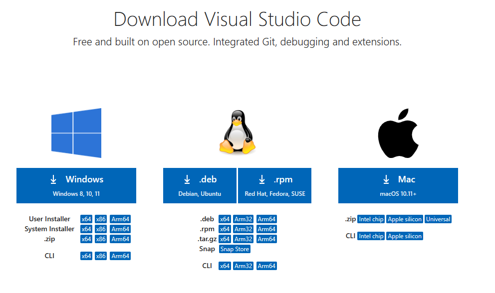

# PowerShell Read Me for YouTube Videos

The purpose of this readme is to provide supporting documentation for the YouTube videos.

## Setting up VS Code

1. This is the [download link](https://code.visualstudio.com/download) for Visual Studio code. This is what you will see.



2. The `Hello Powershell` code.

```
Write-Host "Hello "
Write-Host "PowerShell"
```

3. Some resources to learning the Visual Studio Code Debugger.

    [YouTube Debugging Videos](https://www.youtube.com/results?search_query=using+the+visual+studio+debugger)

